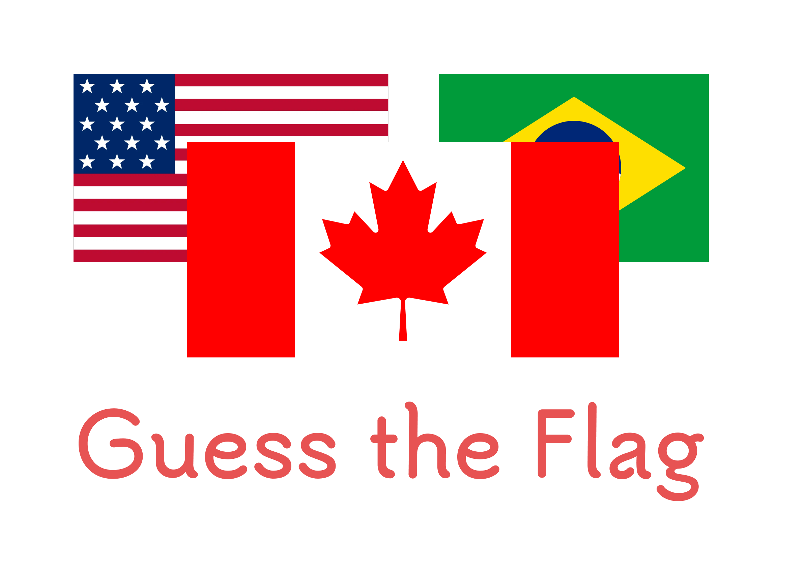

# GuessTheFlag-Video

  

An application designed to completely automate the production of short videos in the 'Guess the Flag' style, specifically crafted for the Brazilian Portuguese audience.

---

## Preview

    <video src="https://github.com/isaacszf/GuessTheFlag-Video/assets/70985216/59e7d716-3ccc-4adc-80c4-c040341f9be8" />

---

## Features

1. **Web Scraping from Wikipedia:**

   - Automated data retrieval of flags from the Wikipedia website to gather information.

2. **Eleven Labs Voice Model:**

   - Integration with the Eleven Labs voice model to pronounce the names of the flags.

3. **Fully Automated Video Creation:**
   - Implementation of a 100% automatic video creation process using the collected flag information and the Eleven Labs voice model.

---

## Requirements

To successfully run the application, you need to populate the information in a `.env` file with the following key-value pairs:

- `ELEVEN_LABS_API`: Your Eleven Labs API key.
- `ELEVEN_LABS_VOICE_MODEL_ID`: Model ID for the Eleven Labs voice.
- `NUM_OF_FLAGS`: The desired number of flags for the videos.
- `PAGE_NAME`: The name of the channel that will post the videos.

---

## Running

First of all, run `npm i`, then:

- `npm run flag-start` - Initiates the web scraping for flags and starts the Remotion Studio for interactive development.

- `npm run flag-build` - Initiates the web scraping for flags and renders the Flags component to generate the final video in the 'out' directory.
